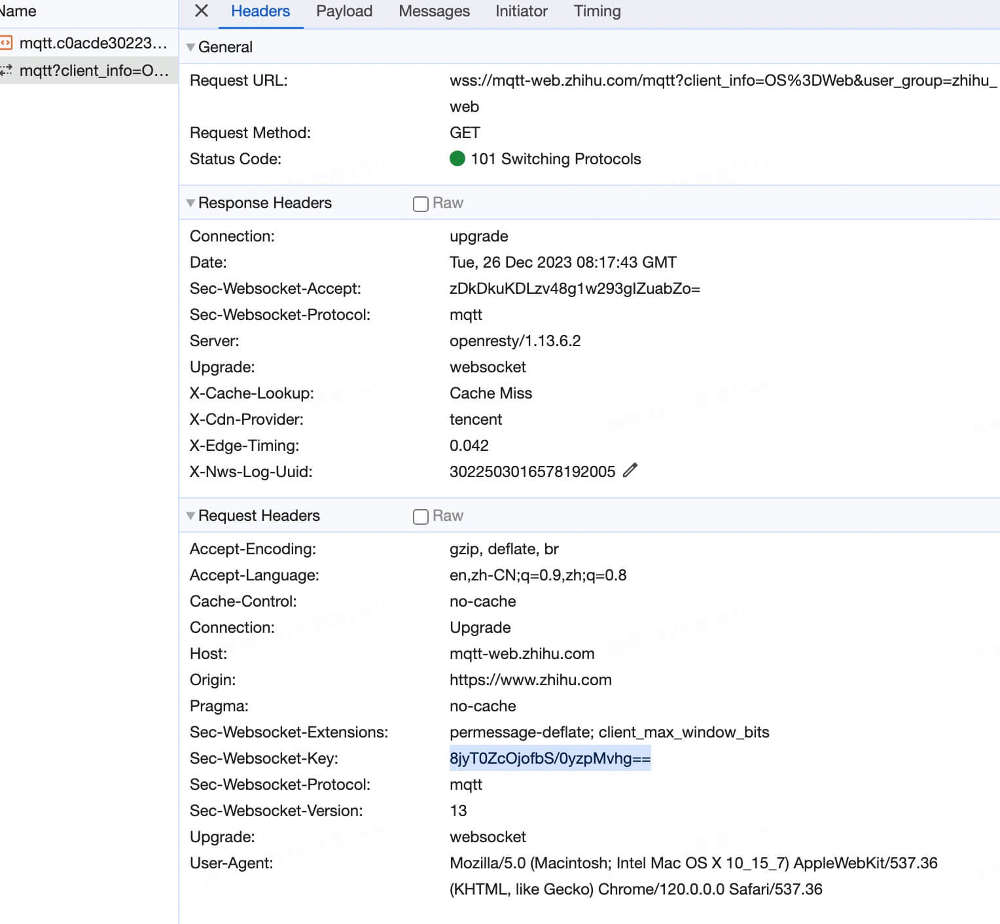
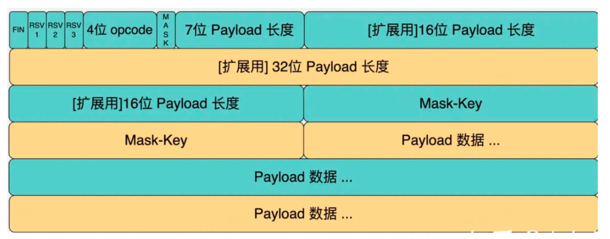

## 运行

静态服务: npx http-server . 
node服务: node ./src/index.js

## WebSocket

实时双向数据通信就使用 WebSocket。

严格来说，WebSocket 和 HTTP 没什么关系，是另一种协议格式。但是还是需要一次从 HTTP 到 WebSocket 的切换过程。


过程如下：

请求的时候header带上: 

```
Connection: Upgrade
Upgrade: websocket
Sec-WebSocket-Key: Ia3dQjfWrAug/6qm7mTZOg==
```

前两个是升级到websocket协议，第三个 `Sec-WebSocket-Key` 是保证安全用的key。

服务端返回的header:

```
HTTP/1.1 101 Switching Protocals
Connection: Upgrade
Upgrade: websocket
Sec-WebSocket-Accept: JkE58n3uIigYDMvC+KsBbGZsp1A=
```

`Sec-WebSocket-Accept` 是对 `Sec-WebSocket-Key`处理之后的结果。加入这个header的校验是为了确定对方一定是有WebSocket能力的，不然万一建立了连接对方却一直没有消息。

Sec-WebSocket-Key 经过什么处理能得到 Sec-WebSocket-Accept 呢？(hashKey function)




websocket具体是什么协议?


