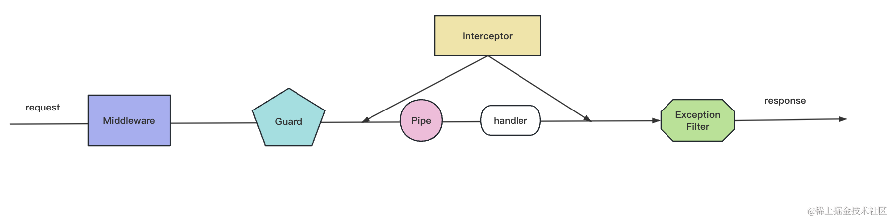

### 连接数据库的方式

1. .env 和 .env.prod

```
app.module.ts

ConfigModule.forRoot({
  isGlobal: true,
  envFilePath: [envConfig.path],
}),
TypeOrmModule.forRootAsync({
  imports: [ConfigModule],
  useFactory: async (configService: ConfigService) => {
    return {
      type: 'mysql', // 数据库类型
      entities: [User], // 数据表实体
      host: configService.get('DB_HOST'), // 主机，默认为localhost
      port: configService.get<number>('DB_PORT'), // 端口号
      username: configService.get('DB_USER'), // 用户名
      password: configService.get('DB_PASSWD'), // 密码
      database: configService.get('DB_DATABASE'), //数据库名
      timezone: '+08:00', //服务器上配置的时区
      synchronize: true, //根据实体自动创建数据库表， 生产环境建议关闭
    };
  },
  inject: [ConfigService],
}),
```

2. ormconfig.json

### 文章

#### 新建文章

登录(校验 token) -> 用户角色是 admin|root -> 对字段验证: title 必传；文章标题不能重复 -> 处理分类和标签的插入，同时判断 status: 如果是 publish 需要设置 publishTime=当前时间

##### 授权守卫 RoleGuard

- 认证(identification): 检查用户是否为合法用户，用于确认用户的身份。这一步不会跟权限扯上关系，登录认证实现的登录获取 token

- 授权(authorization)：通过认证的用户, 获得相应的角色。不同的角色具有不同的权限。比如游客不能写文章、只有查看、点赞的权限

登录后的用户是否有操作权限可以通过`守卫Guard`来实现。



1. `auth/role.guard.ts` 基于角色的身份验证路由守卫

2. 角色装饰器 `@Roles`

3. 路由控制器使用 `RoleGuard`

#### 联表查询

`TypeORM` 提供的多表关联查询方式:

- find

- QueryBuilder

- 原生 SQL

##### find 选项

查询所有文章(不涉及到关联关系)

```
const postRepository = connect.getRepository(PostsEntity)
const result = await postRepository.find()
```

执行的 SQL 类似于:
`select * from post;`

使用`select`指定要查询的字段

```
const postRepository = connect.getRepository(Post)
const result = await postRepository.find({ select: ['id', 'title']})
```

执行的 SQL 类似于:
`select id, title from post;`

查询条件是通过`where`来指定

多表关联`find`查询通过 relations 指定关联查询（前提是先有外键关联关系）：

```
const postRepository = connect.getRepository(Post)
const result = await postRepository.find({ relations: ['author']})
```

执行的 SQL 类似于：

`select a.*, b.* from post as a left join user as b on a.authorId = b.id;`

##### QueryBuilder 相关

创建 QueryBuilder 的三种方式:

```
// 1. 使用 connection:
import { getConnection } from "typeorm";
const user = await getConnection()
    .createQueryBuilder()
    .select("user")
    .from(User, "user")
    .where("user.id = :id", { id: 1 })
    .getOne();

// 2. 使用 entity manager:
import { getManager } from "typeorm";
const user = await getManager()
    .createQueryBuilder(User, "user")
    .where("user.id = :id", { id: 1 })
    .getOne();

// 3.使用 repository:
import { getRepository } from "typeorm";
const user = await getRepository(User)
    .createQueryBuilder("user")
    .where("user.id = :id", { id: 1 })
    .getOne();
```

QueryBilder 中实现连表查询的常用方法是 leftJoinAndSelect

```
const posts = await this.postsRepository
      .createQueryBuilder('post')
      .leftJoinAndSelect('post.tags','tag')
      .getMany()
```

查询结果:

```
[
 {
    id: 46,
    title: '文章1'
    content: '测试文章内容输入....',
    ...
    tags: [
      {
        id: 1,
        name: 'vue'
      },
      {
        id: 9,
        name: 'vuex'
      }
    ]
  }
  ...
]
```

`leftJoinAndSelect`第一个参数是要加载的关系，第二个参数是为此关系的表分配的别名。

##### SQL 原生语句

#### 文章阅读量

对于文章阅读量计数，我们这里采用的方案是，获取文章详情时，阅读量+1。首先表明这个实现只是一个过渡方案，虽然实现简单， 但是有几个问题：

- 当有大量的人同时阅读这个内容的时候，可能涉及到加锁的问题
- 当流量较大时，同时读取和修改同一条数据， 对数据库压力来说压力很大
- 同一个人不停的属性页面，也容易导致数据准确率不高

解决方案就是使用`redis`

### 上传文件到对象存储 COS

文件上传过程实现流程:

- 先获取到上传的文件
- 根据文件后缀判断文件类型，指定上传文件的路径（将不同的文件类型上传到对应的文件夹中）
- MD5 加密文件生成字符串，对文件进行命名
- 查询文件是否已存在于 COS 中，如果存在，则拼接文件路径返回；不存在，调用腾讯云 API 将文件上传到 cos 中

#### Nest 内置文件上传

Nest.js 为 Express 提供了一个基于`multer`中间件包的内置模块，`Multer`处理以`multipart/form-data`格式发布的数据，该格式主要用于通过 HTTP POST 请求上传文件。

安装类型包: `pnpm i @types/multer -D`

要实现单个文件上传，只需要将 `FileInterceptor()` 拦截器绑定到路由， 然后使用`@UploadFile`装饰器从请求中提取文件。
